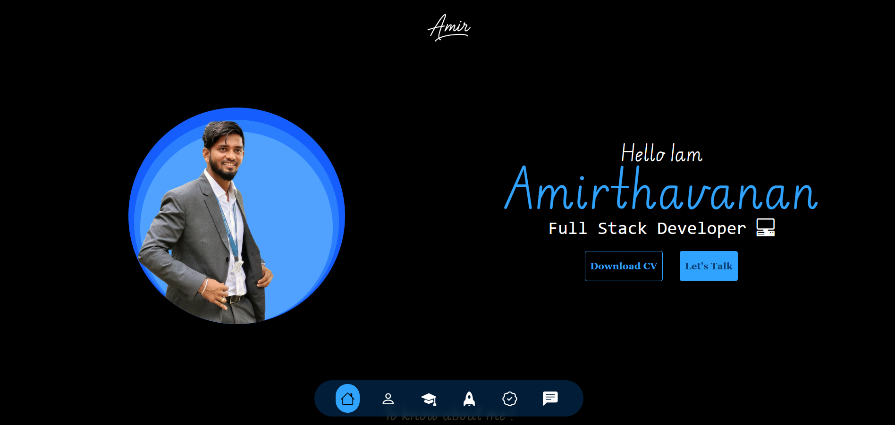
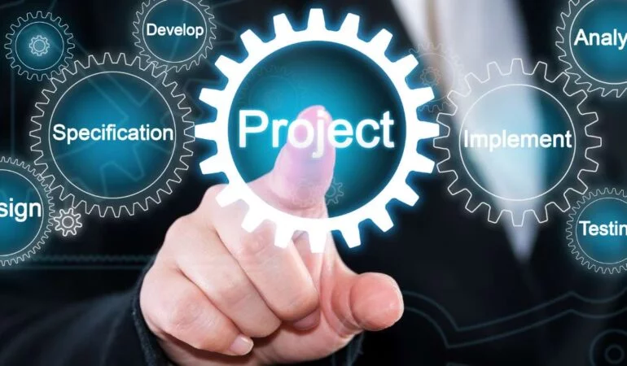

<!-- HEADER / BANNER -->

  

<!-- GREETING -->
<h1 align="center">
  Hey there!   
  I'm Amirthavanan
</h1>
<h3 align="center">Full stack develoepr / Data Analyst</h3>

---

## 🚀 About Me

🎓 **BCA Graduate** (2020–2023) | **MBA Graduate** (2023–2025)  
📍 Based in **Bangalore, India**  
💡 Passionate about **coding, data analytics, and building impactful solutions**  
🌱 Currently exploring **Data Analysis, Software Development, and BI Tools**  

  

---

## 🛠 Skills & Technologies

  
  
  
  
  
  

---

## 📂 Featured Projects

| Project | Description | Preview |
|---------|-------------|---------|
| [**Portfolio Website**](https://github.com/YourRepo) | A personal website showcasing my skills and work. |  |
| [**Python Mini Projects**](https://github.com/YourRepo) | 3 mini-projects using Python (Games, Automation, Analysis). |  |
| [**Plato's Pizza BI Dashboard**](https://github.com/YourRepo) | Data visualization & insights in Power BI. |  |

---

## 🎭 Fun Corner

> _""The best error message is the one that never shows up."_ 😄

🎯 **Hobbies:** Sports 🎮, Photography 📊, Traveling 🌍  
📖 **Currently learing:** Python with data science 🔬
💬 **Ask me about:** Python, SQL, HTML, CSS, JavaScript, BI Tools 🖥️

  

---

## 📫 Connect with Me

  
  
  

---

## 📊 GitHub Stats

  
  

---

   
  <b>Thanks for stopping by! ⭐</b>

